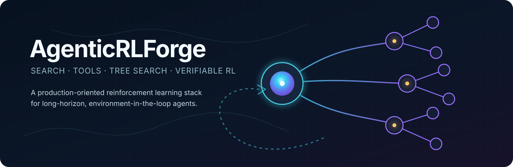
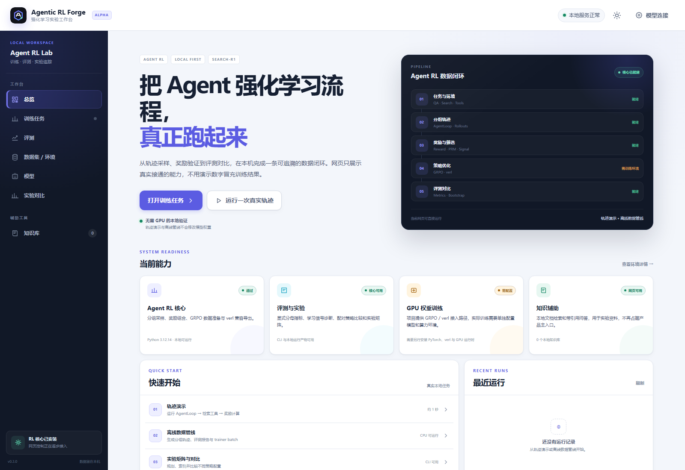
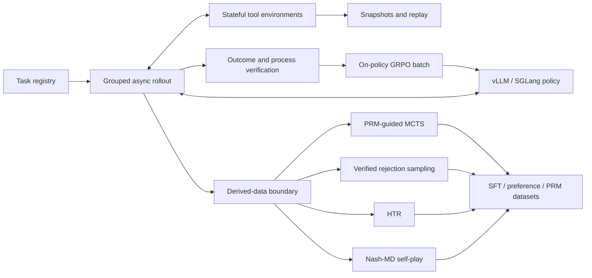

<h1 align="center">AgenticRLForge</h1>

<p align="center">
  
</p>

<p align="center">
  <strong>A local Agent RL workbench for search and tool-using agents.</strong>
</p>

<p align="center">
  <a href="https://github.com/ssddxg/agentic-rl-forge/actions/workflows/ci.yml"></a>
  <a href="https://www.python.org/"></a>
  <a href="LICENSE"></a>
  <a href="https://github.com/ssddxg/agentic-rl-forge"></a>
</p>

<p align="center">
  <strong>English</strong> · <a href="README.zh-CN.md">简体中文</a> ·
  <a href="docs/studio.zh-CN.md">中文使用指南</a> ·
  <a href="https://github.com/ssddxg/agentic-rl-forge/issues">Issues</a>
</p>

AgenticRLForge Studio exposes the repository's real reinforcement-learning workflow in a local
browser interface. Run a complete agent trajectory, inspect tool calls and reward signals, import
your own QA and retrieval JSONL data, execute the CPU-only grouped-rollout pipeline, and review the
evaluation and trainer-batch result. A runtime check clearly separates what works on an ordinary
laptop from GPU weight training that still requires PyTorch, model services, and
[verl](https://github.com/verl-project/verl).

The engine includes Search-R1 collection, multi-turn rollouts, stateful tools, outcome
verification, GRPO utilities, PRM-guided MCTS, rejection sampling, Nash-MD, hindsight relabeling,
evaluation, and reproducible experiment tooling. A private document knowledge base remains
available as an auxiliary tool for retrieval corpora and project references; it is no longer the
main product identity. The application sends no usage telemetry, and local workflows need no
account or API key. Local Prometheus metrics remain available for operators who explicitly use
them.

**Start here:** [Studio features](#what-studio-can-do) · [quick start](#quick-start) ·
[architecture](#architecture) · [development and verification](#development-and-verification)

<p align="center">
  
</p>

<p align="center"><em>The local Studio: real trajectory execution, offline RL data flow, runtime readiness, and run history.</em></p>

## What Studio can do

- Execute a real two-step search-agent trajectory and inspect actions, observations, token masks,
  reward components, and the final outcome.
- Upload custom QA and retrieval-corpus JSONL data, or start with the bundled sample dataset.
- Run the full offline Agent RL data path in the background: grouped rollouts, durable trajectories,
  evaluation, learning-signal filtering, recoverable shards, and verified trainer-batch export.
- Keep a local run history and recover interrupted work instead of leaving tasks permanently busy.
- Check core and training prerequisites, with honest readiness status for PyTorch and verl.
- Use GRPO, Nash-MD, PRM/MCTS, experiment matrices, comparisons, promotion, and artifact tooling
  through the Python package and CLI.
- Use the secondary private knowledge workspace for PDF, DOCX, HTML, Markdown, RST, and text search
  or cited OpenAI-compatible answers.
- Run from a Windows double-click launcher, a terminal command, or Docker Compose.

## Why this project

Training a reasoning model to emit a search tag is useful, but real agents need more:

- browser and API tools mutate state and must be isolated, snapshotted, restored, and replayed;
- GRPO requires grouped rollouts from the exact policy version being optimized;
- MCTS, rejection sampling, replay, and hindsight relabeling create derived data that must not
  silently enter an on-policy batch;
- sparse rewards need process guidance, while process reward models require calibration and
  protection from reward hacking;
- test-time search should spend compute adaptively instead of imposing the same cost on every
  task.

AgenticRLForge makes those constraints explicit and testable.

## Capabilities

| Area | Included |
| --- | --- |
| Local Studio | Browser-based RL overview, trajectory inspection, custom dataset upload, offline pipeline runs, runtime diagnostics, run history, and an auxiliary local knowledge base |
| Search-R1 | Interleaved search/reasoning protocol, exact-match rewards, retrieval service, and generated/observation token masks |
| Local knowledge base | PDF/DOCX/HTML/text ingestion, strict validation, multilingual BM25, direct CLI search, and safe hot reload |
| Rollout | Async multi-turn loop, grouped collection, OpenAI-compatible vLLM/SGLang client, policy-version guards |
| Environments | Typed tools, JSON Schema validation, timeouts, side-effect semantics, session isolation, snapshot and restore |
| RL | GRPO advantage utilities and verl-compatible task/trajectory export |
| Test-time compute | Calibrated PRM interface, adaptive budgets, PUCT MCTS, value-guided pruning |
| Data flywheel | Executable rejection sampling, deduplication, SFT export, immutable provenance |
| Self-play | Nash-MD geometric policy mixtures and reference-free β=0 self-play mode |
| Hindsight | Verified achieved-goal relabeling, confidence gates, supporting evidence, irrelevant-action masks |
| Benchmarks | Search-R1 dataset builder, WebArena task and browser-tool contracts, remote isolated environments |
| Persistence | Content-verified SQLite storage, portable manifests, signed deterministic run and promotion archives, resumable receiver acquisition, immutable import/export, and version filters |
| Run safety | Renewable heartbeats, epoch-fenced writes, stale-run reporting/reconciliation, and per-slot cross-host claims |
| Distributed capture | Atomic per-trajectory shards, interruption recovery, immutable manifests, and streaming callbacks |
| Object storage | Conditional local/S3-compatible writes, resumable trusted release mirroring, allowlisted HTTPS/S3 promotion fetches, destination-side operations ledgers, and content-verified trainer batches |
| Reproducibility | Deterministic experiment matrices, cross-plan metric indexes, Pareto dashboards, signed promotion evidence, checkpoint ancestry checks, corpus fingerprints, and automated release auditing |
| Evaluation | Explicit-denominator metrics, group pass rates, reward-variance diagnostics, and trajectory-diversity checks |
| PRM data | Discounted step returns, confidence weights, immutable lineage, group advantages, and task-isolated splits |
| Training quality | On-policy group filtering, reward-signal ranking, paired policy comparisons, and bootstrap intervals |
| Checkpoints | Immutable manifests, local artifact hashing, parent lineage, step ordering, and drift verification |
| Operations | CLI, Prometheus metrics, health checks, strict typing, linting, tests, and automated release auditing |

## Quick start

AgenticRLForge supports Python 3.10, 3.11, and 3.12. Python 3.13+ is not supported yet.

### Windows: double-click to install and open

Download or clone this repository, then double-click:

```text
Start AgenticRLForge.cmd
```

The first run creates a private Python environment, installs the application, checks it, starts
Studio at <http://127.0.0.1:7860>, and opens that page in your browser. Later launches reuse the
same installation. Keep the small launcher window open while using Studio.

### Linux or macOS

From the downloaded project directory, run:

```sh
bash scripts/start-studio.sh
```

You can also start it directly after installation with `arf studio`. Studio binds only to your own
computer by default. Use `Ctrl+C` in the launcher window to stop it.

Once the page opens, start with **trajectory demo** to watch one real agent loop, then run the
bundled **offline pipeline** or upload your own QA/corpus JSONL pair. These local checks do not
train model weights and need no GPU. The page reports separately whether the optional PyTorch and
verl training runtime is installed. The knowledge-base section remains available for documents;
AI answering is optional and only needs a model endpoint when you choose to use it.

For a step-by-step Chinese guide, data locations, model examples, and troubleshooting, see
[`docs/studio.zh-CN.md`](docs/studio.zh-CN.md).

### Command-line local search

The original file-to-corpus workflow remains available for scripts and automated pipelines:

```bash
arf corpus-build ./my-documents ./data/my-corpus.jsonl
arf corpus-check ./data/my-corpus.jsonl
arf search "What does the project say about deployment?" \
  --corpus ./data/my-corpus.jsonl --top-k 5
```

The builder recursively scans supported files, creates deterministic overlapping chunks, keeps
source metadata, removes duplicate chunks, and publishes the JSONL atomically. Existing output is
never replaced unless `--force` is provided. Search runs entirely on the local machine and needs no
Docker, GPU, model API, or `server` extra. Unicode normalization and CJK unigram/bigram tokenization
support English, Chinese, Japanese, Korean, and mixed-language text.

Use `--json` with `corpus-check` or `search` for stable machine-readable output.
See [`docs/local-search.md`](docs/local-search.md) for corpus format, limits, hot reload, and HTTP
operations.

### Docker Compose

If Docker Desktop or Docker Engine with Compose v2 is already installed:

```bash
docker compose up --build
```

Then open <http://127.0.0.1:7860>. Documents and settings are kept in the named `studio-data`
volume, so rebuilding or restarting the container does not remove them. Set `ARF_PORT` if port
7860 is already in use. The port is published only to the local computer by default.

### Install only the published CLI (after the first PyPI release)

Once a release is available on PyPI, install only the library and commands with:

```bash
python -m venv .venv
source .venv/bin/activate
python -m pip install "agentic-rl-forge[studio]"

arf studio
```

On Windows, activate with `.venv\Scripts\Activate.ps1`. A package installation provides the Python
library and `arf` commands. Clone the repository when you also need `configs/`, `examples/`,
`recipes/`, Docker Compose, or the development scripts.

For manual source development, install
`python -m pip install -e ".[dev,studio,research,signing]"` from a complete checkout.

The demo executes a complete local trajectory:

```text
question → policy search action → retrieval observation → final answer
         → token mask → reward composition → provenance validation
```

It requires neither a GPU nor an external model service.

Validate the complete offline data path with your own QA set and corpus:

```bash
arf offline-pipeline examples/data/qa.jsonl examples/data/corpus.jsonl \
  artifacts/offline-run
```

This creates grouped deterministic rollouts, SQLite state, recoverable shards, an evaluation
report, filtered trajectories, and a verified trainer batch. The seeded policy intentionally
produces both accepted and rejected answers to exercise learning-signal checks; it validates the
pipeline and is not a model-quality benchmark. Every question must retrieve answer-bearing corpus
evidence, otherwise the command stops with a clear error instead of producing a misleading run.
The output records stable QA and corpus digests so a run can be traced back to its exact inputs.
On Windows, use an absolute output path of at most 133 ordinary characters (for example,
`C:\arf-runs\run-1`); the command checks this before writing so every nested shard remains readable
by standard Windows tools.

Preview a content-addressed Search-R1 sampling matrix without contacting model services:

```bash
arf experiment-plan configs/experiments/search_r1_matrix.yaml \
  --output artifacts/experiments/search-r1.plan.json

arf experiment-run artifacts/experiments/search-r1.plan.json \
  --root . --state-dir artifacts/experiment-state
```

The plan freezes every rendered trial, resolved config, command, declared artifact, and regression
gate. Confirm its exact ID before `experiment-run --execute`; successful stages resume from
immutable input/output evidence and the final report can fail CI independently on incomplete work,
execution failures, or metric regressions. See [reproducible experiment matrices](docs/experiments.md).

Discover every valid plan below a state directory and produce a stable parameter/metric table:

```bash
arf experiment-index --root . --state-dir artifacts/experiment-state \
  --output artifacts/experiments/index.json \
  --csv-output artifacts/experiments/index.csv --fail-on-issues
```

The index exposes content-derived metric IDs that `experiment-analyze` uses for weighted ranking,
exact baseline deltas, and multi-objective Pareto-front detection. Its Markdown and standalone HTML
exports are deterministic and require no tracking server.

Turn one analyzed trial into a reviewable release candidate without copying heavyweight payloads:

```bash
arf experiment-promote artifacts/experiments/index.json \
  artifacts/experiments/analysis.json \
  --name search-r1-candidate --plan-id EXPERIMENT_PLAN_ID \
  --trial-id EXPERIMENT_TRIAL_ID --root . \
  --state-dir artifacts/experiment-state
```

The preview revalidates the current report, required artifacts, checkpoint bytes, dataset lineage,
rank/Pareto policy, and discovery health. Exact preview confirmation plus independent approver
identities conditionally publishes one immutable decision, reproducibility manifest, metadata
snapshots, and escaped model card. See the [promotion workflow](docs/experiments.md#experiment-promotion).

After confirmation, package and inspect the exact metadata as reproducible release bytes:

```bash
arf experiment-promotion-pack \
  artifacts/experiment-promotions/search-r1-candidate \
  artifacts/releases/search-r1-candidate.promotion.tar.gz

arf experiment-promotion-inspect \
  artifacts/releases/search-r1-candidate.promotion.tar.gz
```

Optional Ed25519 attestations bind the archive receipt to an independently trusted publisher key;
safe unpack verifies the signature, canonical archive structure, contracts, cross-file identities,
and regenerated model card before atomically exposing the destination.

Advance that signed archive through an append-only deployment lifecycle and inspect the registry:

```bash
arf experiment-promotion-lifecycle RELEASE.promotion.tar.gz RELEASE.attestation.json \
  --registry-dir artifacts/promotion-registry --target-stage candidate \
  --operator release-operator --reason "register the reviewed candidate" \
  --authorizer release-owner --public-key trust/promotion-release.pub

arf experiment-promotion-registry-status artifacts/promotion-registry --fail-on-issues
```

Lifecycle changes and environment aliases use exact preview confirmation. Conditional-create
sequence slots prevent conflicting transitions, aliases use compare-and-swap generations, and
rollback requires verified ancestry in the same environment. Publisher signatures authenticate
the archive while deployment authorizers remain a separate governance control.

Remote artifacts are fetched only through a separate, explicit authorization plan. The fetcher
supports HTTPS and S3, exact host or bucket allowlists, source validators, bounded range reads,
resumable immutable chunks, and final signed-manifest digest verification:

```bash
arf experiment-promotion-fetch-remote \
  RELEASE.promotion.tar.gz RELEASE.attestation.json artifacts/promotion-cache \
  --public-key trust/promotion-release.pub \
  --https-allow-authority models.example.com \
  --s3-allow-bucket reviewed-models \
  --plan-output artifacts/releases/remote-fetch-plan.json --fail-on-ineligible

# Review the plan, then repeat with both options:
#   --execute --confirm-plan-id REMOTE_FETCH_PLAN_ID
#   --record-output artifacts/releases/remote-fetch-record.json
```

Redirects are refused, URIs outside the exact allowlists are never contacted, and the remote fetch
record is committed only after every chunk and complete artifact match the signed promotion
manifest. GCS and Azure URIs remain visible but ineligible until a supported transport is supplied.

Receivers can then verify and materialize the complete artifact graph:

```bash
arf experiment-promotion-acquire RELEASE.promotion.tar.gz RELEASE.attestation.json \
  artifacts/received-promotions --root /srv/project --state-dir /srv/experiment-state \
  --public-key trust/promotion-release.pub \
  --remote-record artifacts/releases/remote-fetch-record.json \
  --plan-output artifacts/releases/acquisition-plan.json --fail-on-ineligible
```

Review the exact plan ID, then repeat with `--execute --confirm-plan-id`. The plan streams every
project/state artifact and fetched remote artifact through size and SHA-256 verification, reparses
known native contracts, and checks checkpoint payloads, parent ancestry, and dataset lineage.
Remote URIs without an explicit fetch record remain unresolved and are never contacted by the
acquisition command. Materialized files use a content-addressed acquisition prefix; an immutable
record is committed last, so interrupted copies resume without overwriting conflicting bytes.

For the full data path from grouped rollout collection to a content-verified trainer batch, run:

```bash
python examples/offline_pipeline.py --output-dir artifacts/offline-example
```

This CPU-only example persists trajectories to SQLite and recoverable shards, records metrics,
computes a benchmark report, filters groups by learning signal, and exports the exact payload a
trainer may consume. See [`examples/README.md`](examples/README.md) for its artifact layout and
fixture data.

Persist the trajectory, compute a benchmark report, and derive a process-reward dataset:

```bash
arf demo --output artifacts/demo-trajectories.jsonl
arf trajectory-import artifacts/demo-trajectories.jsonl artifacts/trajectories.db \
  --run-name local-demo
arf trajectory-summary artifacts/trajectories.db
arf evaluate artifacts/trajectories.db --benchmark local-demo \
  --output artifacts/local-demo-report.json
arf build-prm-dataset artifacts/trajectories.db artifacts/local-demo-prm.jsonl
```

The SQLite store uses WAL mode, validates every record against the trajectory contract, and
rejects reuse of a trajectory ID with different content. Run manifests preserve the input
configuration and policy/environment versions, while exports remain deterministic JSONL.

For multi-worker collection on a shared filesystem, write immutable trajectory shards instead of
having every process append to one file:

```bash
arf shard-import artifacts/demo-trajectories.jsonl artifacts/sharded-runs \
  --run-id local-demo
arf shard-finalize artifacts/sharded-runs --run-id local-demo \
  --expected-policy-version local-demo-policy
```

Each trajectory is committed independently with an exclusive atomic link. A completed batch gets
a content-addressed manifest that can be verified and compacted into deterministic JSONL. Existing
shards remain recoverable if collection stops before batch finalization.

## Run a Search-R1-compatible retriever

Build a corpus from documents:

```bash
arf corpus-build documents data/corpus.jsonl
arf corpus-check data/corpus.jsonl
```

Or create JSONL manually:

```json
{"id":"france","contents":"Paris is the capital and largest city of France."}
{"id":"germany","contents":"Berlin is the capital and largest city of Germany."}
```

Start the local BM25 endpoint:

```bash
arf serve-retriever data/corpus.jsonl --port 8000
```

Add `--reload-interval 5` to atomically pick up valid corpus changes. Use `/stats` to inspect the
active generation, corpus/index digests, document and term counts, tokenizer version, and latest
reload result. Request batches are bounded and evaluated outside the async event loop, with a
configurable service-level concurrency limit. Direct launches bind to `127.0.0.1` by default. The
service has no built-in authentication; keep the loopback default unless an authenticated reverse
proxy and appropriate network controls protect it.

The `/retrieve` endpoint implements the same batched request shape used by Search-R1:

```json
{"queries":["capital of France"],"topk":3,"return_scores":true}
```

For large corpora, replace the local service with FAISS, Elasticsearch, Vespa, or another
retrieval backend while keeping the same protocol.

## Collect real Search-R1 rollouts

Once an OpenAI-compatible vLLM or SGLang model endpoint and the retriever are available, collect
durable grouped rollouts without writing orchestration code:

```bash
export OPENAI_API_KEY=your-model-endpoint-key
arf collect-search-r1 data/qa.jsonl artifacts/collections \
  --config configs/search_r1_collection.yaml
```

Every completed trajectory is written to SQLite and an atomic shard before batch completion. A
successful run also emits immutable JSONL, a benchmark report, Prometheus metrics, a finalized
run manifest, a machine-readable summary, and a content-addressed artifact manifest under its run
ID. Input bytes, task selection, policy version, decoding parameters, and reward settings are
recorded; API key values are not.
Content-addressed rollout plans give every group and attempt a stable slot identity, so re-running
the same configuration validates and reuses completed slots while collecting only missing ones.
Append-only slot claims prevent two hosts sharing the same coordination store from starting the
same missing slot at once. Healthy attempts extend ownership through immutable renewal heartbeats;
expired or abandoned attempts are taken over with a higher epoch and late workers are fenced before
persistence.
Use `arf search-r1-plan-status` with the same source, output root, and config to inspect exact
reusable and missing slots without making network requests.
Use `arf slot-claim-status PLAN.json OUTPUT_ROOT` to inspect current claim owners, epochs, expiry,
and release outcomes without mutating coordination state.

See [`docs/collection.md`](docs/collection.md) for configuration, artifact layout, failure
recovery, and trainer handoff.

Verify a copied or published collection bundle without model or retrieval services:

```bash
arf run-artifacts-verify \
  artifacts/collections/runs/RUN_ID/artifact-manifest.json
```

Publish one run without copying unrelated collection state:

```bash
arf run-artifacts-pack \
  artifacts/collections/runs/RUN_ID/artifact-manifest.json \
  artifacts/releases/RUN_ID.tar.gz

arf run-artifacts-unpack \
  artifacts/releases/RUN_ID.tar.gz \
  artifacts/received/RUN_ID
```

Packing writes a byte-reproducible archive and `RUN_ID.tar.gz.sha256`. Unpacking checks that
digest before reading members, rejects unsafe or noncanonical tar layouts, extracts into a
temporary directory, and publishes the destination only after recursive bundle verification.

Authenticate the publisher when the archive and checksum travel through the same untrusted
channel:

```bash
pip install -e ".[signing]"
arf manifest-keygen secrets/release.key artifacts/release.pub
arf run-artifacts-sign artifacts/releases/RUN_ID.tar.gz \
  artifacts/releases/RUN_ID.attestation.json \
  --private-key secrets/release.key
arf run-artifacts-signature-verify artifacts/releases/RUN_ID.tar.gz \
  artifacts/releases/RUN_ID.attestation.json \
  --public-key artifacts/release.pub
```

Verification trusts only explicitly supplied public keys. The attestation binds the exact archive
receipt, run and manifest identities, signer key ID, and signing time; an embedded public key alone
is never treated as a trusted publisher.

Publish large archives through resumable immutable chunks instead of loading one object into
memory:

```bash
arf run-artifacts-publish artifacts/releases/RUN_ID.tar.gz \
  --store-root artifacts/release-store \
  --attestation artifacts/releases/RUN_ID.attestation.json \
  --workers 4

arf run-artifacts-list --store-root artifacts/release-store

arf run-artifacts-fetch RUN_ARCHIVE_ID artifacts/downloads/RUN_ID.tar.gz \
  --store-root artifacts/release-store \
  --public-key artifacts/release.pub \
  --require-attestation \
  --workers 4
```

The same commands accept `--s3-bucket`, `--s3-prefix`, `--s3-endpoint-url`, and `--s3-region`.
Publication writes content-addressed chunks and verifies each remote byte before creating the final
commit marker. Interrupted uploads remain invisible; interrupted downloads resume from a locally
verified chunk boundary. Worker concurrency is bounded, while manifest order and commit-last
visibility remain deterministic.

Inspect a prefix and safely reclaim an aged interrupted publication with a preview-bound command:

```bash
arf run-artifacts-status RUN_ARCHIVE_ID --store-root artifacts/release-store
arf run-artifacts-gc RUN_ARCHIVE_ID --store-root artifacts/release-store \
  --min-age-seconds 86400 --output artifacts/gc-preview.json
arf run-artifacts-gc RUN_ARCHIVE_ID --store-root artifacts/release-store \
  --min-age-seconds 86400 --execute \
  --confirm-state-digest STATE_DIGEST \
  --operator release@example.com \
  --reason "interrupted publication exceeded retention window"
```

GC and publication conditionally claim the same decision key, so a commit and cleanup tombstone
cannot both win. The collector protects every committed graph, detects objects added or changed
after preview, resumes interrupted deletes, and preserves an immutable completion record.

For shared stores, `run-artifacts-inventory` summarizes every lifecycle state and byte count;
`run-artifacts-gc-plan` freezes the exact eligible candidate set and aggregate reclaimable bytes.
`run-artifacts-gc-batch` is read-only without `--execute` and requires the reviewed plan ID,
operator, and reason before running a bounded number of per-prefix collectors. Its durable batch
intent and member records make partial completion safely resumable.

Mirror a committed release directly between local or S3-compatible stores without downloading an
archive to an operator workstation:

```bash
arf run-artifacts-mirror-plan RUN_ARCHIVE_ID \
  --source-s3-bucket primary-releases \
  --source-s3-prefix search-r1 \
  --destination-s3-bucket replica-releases \
  --destination-s3-prefix search-r1 \
  --public-key trust/release.pub \
  --require-attestation \
  --output artifacts/mirrors/RUN_ARCHIVE_ID.plan.json

arf run-artifacts-mirror artifacts/mirrors/RUN_ARCHIVE_ID.plan.json \
  --source-s3-bucket primary-releases \
  --source-s3-prefix search-r1 \
  --destination-s3-bucket replica-releases \
  --destination-s3-prefix search-r1 \
  --public-key trust/release.pub \
  --execute \
  --confirm-plan-id RUN_MIRROR_PLAN_ID \
  --operator release@example.com \
  --reason "approved cross-region release replication" \
  --workers 4 \
  --output artifacts/mirrors/RUN_ARCHIVE_ID.record.json
```

Planning is read-only and binds the authenticated source graph, exact source and destination object
identities, objects to copy or reuse, unexpected destination objects, and byte totals into one
content-derived plan ID. Execution revalidates that snapshot, copies non-commit objects with bounded
parallelism, and publishes the destination commit last. Exact retries reuse verified progress and
the immutable mirror evidence; source drift, destination drift, or a conflicting object fails
closed.

For repository-wide disaster-recovery or migration, freeze every committed source release—or an
explicit repeated `--archive-id` allowlist—into one authenticated batch plan:

```bash
arf run-artifacts-mirror-batch-plan \
  --all-committed \
  --source-s3-bucket primary-releases \
  --destination-s3-bucket replica-releases \
  --public-key trust/release.pub --require-attestation \
  --max-releases 256 --max-copy-bytes 1099511627776 \
  --workers 4 \
  --output artifacts/mirrors/store.plan.json

arf run-artifacts-mirror-batch artifacts/mirrors/store.plan.json \
  --source-s3-bucket primary-releases \
  --destination-s3-bucket replica-releases \
  --public-key trust/release.pub \
  --execute --confirm-plan-id RUN_MIRROR_BATCH_PLAN_ID \
  --operator release@example.com \
  --reason "approved disaster-recovery synchronization" \
  --release-workers 4 --object-workers 2 \
  --output artifacts/mirrors/store.record.json
```

The plan embeds both lifecycle inventories, the frozen release allowlist, every per-release mirror
plan, aggregate copy/reuse forecasts, and hard release-count and copy-byte caps. Execution persists
an intent before work, limits the product of release and object workers to 64, and preserves
successful member evidence across failures. Batch completion and administrative resolution compete
for one immutable `decision.json`; the winner is authoritative, while `record.json` or
`resolution.json` is a recoverable query sidecar.

Discover operations from the destination, inspect one by ID, or preview a safe resolution:

```bash
arf run-artifacts-mirror-batch-list \
  --destination-s3-bucket replica-releases

arf run-artifacts-mirror-batch-inspect RUN_MIRROR_BATCH_ID \
  --source-s3-bucket primary-releases \
  --destination-s3-bucket replica-releases \
  --public-key trust/release.pub

arf run-artifacts-mirror-batch-resolve RUN_MIRROR_BATCH_ID \
  --source-s3-bucket primary-releases \
  --destination-s3-bucket replica-releases \
  --public-key trust/release.pub
```

Resolution is allowed only for an entirely unstarted batch or an invalid batch that cannot make
safe progress. Execution requires the inspected status digest, resolver, reason, and either
`cancelled` or `superseded`; supersession also requires a different replacement plan ID. Active
partial progress cannot be resolved. Quiesce executors before resolving when operationally
possible: resolution fences the batch outcome but does not roll back release objects or member
records already being written.

## Prepare training data

Input JSONL:

```json
{"id":"nq-1","question":"What is the capital of France?","answer":"Paris"}
```

Convert it into verl-compatible records:

```bash
pip install -e ".[data]"
arf prepare-search-r1 data/qa.jsonl data/search_r1.parquet --dataset custom-qa

# JSONL is also supported for inspection and non-verl pipelines.
arf prepare-search-r1 data/qa.jsonl data/search_r1.jsonl --dataset custom-qa
arf inspect-task data/search_r1.jsonl
```

Each record contains the prompt, rule-based ground truth, tool schemas, step limits, task ID,
and dataset provenance.

## Train with verl

Install verl and a supported rollout backend in the GPU environment, start the retrieval
service, then run:

```bash
export TRAIN_FILES=/data/search_r1_train.parquet
export VAL_FILES=/data/search_r1_val.parquet
export MODEL_PATH=Qwen/Qwen2.5-3B-Instruct
export ROLLOUT_ENGINE=vllm

bash recipes/verl/run_search_r1_grpo.sh
```

The recipe uses GRPO, five responses per prompt, multi-turn search, the project search tool,
KL regularization, and no critic model. Override any verl setting by appending Hydra arguments.

The tool configuration is in [`configs/verl/search_tool.yaml`](configs/verl/search_tool.yaml).
The standalone runtime configuration is in [`configs/search_r1.yaml`](configs/search_r1.yaml).

## Architecture



The online and derived-data paths share tools and verifiers but do not share batch semantics.
Every trajectory records its policy version, environment version, source, parents, transform,
token masks, snapshots, rewards, and task group.

The evaluation path also diagnoses whether GRPO groups contain a usable learning signal. It
reports reward variance, semantic trajectory diversity, zero-variance group rate, and the exact
numerator and denominator for every aggregate metric. This makes collapse and uninformative
rollout batches visible before an expensive optimization step.

Low-signal groups can be removed without changing the trajectories that remain:

```bash
arf filter-rollouts artifacts/trajectories.db artifacts/filtered.jsonl \
  --policy-version policy-v1 --expected-group-size 5 \
  --min-reward-stddev 0.01 --report artifacts/filter-report.json
```

The filter rejects stale or mixed policy data, incomplete groups when an expected size is set,
low reward variance, insufficient semantic diversity, and groups outside an optional top signal
fraction. It never relabels or converts derived data into an on-policy batch.

See [`docs/architecture.md`](docs/architecture.md) for package boundaries and dependency flow,
and [`docs/api.md`](docs/api.md) for the supported Python imports and embedding examples.

## PRM-guided adaptive MCTS

Tree search operates over typed agent actions rather than unstructured text. Each branch:

1. restores the parent environment snapshot;
2. executes the candidate API or browser action;
3. captures the resulting observation and next snapshot;
4. scores the state with a calibrated process reward model;
5. prunes low-value actions and backs up environment rewards with PUCT.

The budget allocator combines policy entropy, PRM uncertainty, task complexity, and recent
failure rate. Easy tasks receive the minimum branch/simulation budget; uncertain tasks can use
the configured maximum.

## Nash-MD without misleading reference-model claims

For β in `(0, 1]`, the opponent distribution is the normalized geometric mixture

```text
π_mix(y) ∝ π_current(y)^(1-β) · π_reference(y)^β
```

and therefore requires reference log probabilities. Setting β to zero enables explicit
reference-free self-play. The implementation exposes this distinction instead of treating all
Nash-MD configurations as reference-free.

## Verified hindsight trajectory relabeling

Failed trajectories are never relabeled solely because a model says they look useful. A goal
must have:

- supporting step indices;
- confidence above the configured threshold;
- executable evidence from the environment or tool result;
- verifier confidence above the acceptance threshold;
- an action-level loss mask that excludes unrelated failure steps.

Accepted examples retain the failed trajectory as their immutable parent.

## Persistent trajectories and PRM data

The local store is intentionally based on SQLite rather than an external database so the same
workflow runs on a laptop, CI worker, or single training node. It supports run-scoped queries,
policy/environment filters, status and provenance filters, idempotent insertion, and atomic
batch writes. The storage API remains narrow enough to replace with an object-store or warehouse
adapter for distributed deployments.

`PRMDatasetBuilder` converts stored trajectories into step-level examples using discounted
verified returns. It records the source trajectory as immutable provenance, retains the GRPO
group mean, standard deviation, and standardized advantage, and assigns splits by hashing the
task ID. All steps for the same task therefore stay in one split.

## Service observability

The retriever and process-reward service expose `/health` and dependency-free Prometheus text
metrics at `/metrics`; the retriever also exposes read-only index details at `/stats`. Built-in
measurements cover request counts and latency, retrieval volume, zero-hit queries, index generation
and concurrency limits, PRM batch size and latency, rollout status, token volume, duration, and
reward distributions.
Applications embedding the core runtime can use `MetricsRegistry.record_trajectory` without
running an HTTP server.

See [`docs/operations.md`](docs/operations.md) for persistence, evaluation, PRM data, and metric
semantics.

Stale runs are never changed by monitoring alone. Preview a specific reconciliation, then execute
only with the exact state digest, an operator identity, and a reason:

```bash
arf run-reconcile artifacts/collections/trajectories.db RUN_ID --stale-after 300
arf run-reconcile artifacts/collections/trajectories.db RUN_ID --stale-after 300 \
  --execute --confirm-state-digest STATE_DIGEST \
  --operator operator@example.com --reason "worker host was terminated"
```

See [`docs/distributed-rollouts.md`](docs/distributed-rollouts.md) for streaming scheduler
callbacks, shard recovery, and shared-filesystem guarantees.

See [`docs/slot-claims.md`](docs/slot-claims.md) for cross-host duplicate-call suppression,
consistency requirements, expiry behavior, and deployment limits.

After signal filtering, create the exact payload a trainer is allowed to consume:

```bash
arf trainer-batch-export artifacts/filtered.jsonl artifacts/trainer-store \
  --policy-version policy-v1 --group-size 5 --source-run-id RUN_ID
```

The exporter revalidates on-policy provenance, policy version, group size, task grouping, response
masks, and trajectory membership. It stores verl-compatible trajectory JSONL and an immutable
manifest through the same conditional blob interface used by local or S3-compatible storage.

See [`docs/object-storage.md`](docs/object-storage.md) for conditional cloud writes and trainer
handoff guarantees.

Freeze train and validation inputs before a GPU run:

```bash
arf dataset-manifest artifacts/dataset-manifest.json --name search-r1-run \
  --split-file train=artifacts/train.jsonl \
  --split-file validation=artifacts/validation.jsonl \
  --id-field extra_info.task_id
```

The builder fingerprints raw bytes, records every ID, counts duplicates, and rejects IDs shared by
different splits. Collection manifests can be signed with an optional Ed25519 key and verified
without trusting filenames or modification times.

Before publishing, run the evidence-based release gate:

```bash
arf release-audit --project . --run-checks --build-wheel
```

The audit checks repository metadata, documentation links and placeholders, license, common secret
patterns, generation traces, Git history and cleanliness, Ruff, Mypy, Pytest, recipe syntax, and
wheel construction. See
[`docs/release.md`](docs/release.md).

## Reproducible comparisons and checkpoints

Policy comparisons are paired by task ID and optionally require equal attempt counts. Confidence
intervals are computed by deterministic paired bootstrap over task-level deltas, so a candidate
is not credited for being evaluated on an easier task set.

```bash
arf compare artifacts/trajectories.db \
  --baseline-policy policy-v1 --candidate-policy policy-v2 \
  --benchmark search-r1 --output artifacts/v1-v2.json
```

Checkpoint manifests bind a training run and step to the exact config and local artifacts:

```bash
arf checkpoint-register artifacts/checkpoints \
  --run-id RUN_ID --step 100 --policy-version policy-v2 \
  --config configs/search_r1.yaml \
  --artifact actor=/checkpoints/step-100/actor.safetensors
```

Registration hashes every local artifact, writes the manifest atomically, and refuses conflicting
content under an existing checkpoint ID. `arf checkpoint-verify` detects missing, resized, or
modified files. Parent checkpoint IDs, dataset/RNG digests, framework versions, and evaluation
metrics are available through the Python contract.

The preflight and acceptance gates for a real verl run are documented in
[`docs/gpu-validation.md`](docs/gpu-validation.md).

## WebArena

[`configs/webarena.yaml`](configs/webarena.yaml) defines the long-horizon rollout, remote
environment, tree-search, and hindsight settings. The Python integration supplies typed browser
tools and converts WebArena records into normal `TaskSpec` objects. Browser execution is kept in
a remote isolated environment so reset and snapshot behavior can be scaled independently from
GPU workers.

## Development and verification

```bash
ruff check .
ruff format --check src tests examples
mypy src examples/offline_pipeline.py
pytest --cov=agentic_rl_forge --cov-report=term-missing
bash -n recipes/verl/run_search_r1_grpo.sh
```

Public changes are summarized in [`CHANGELOG.md`](CHANGELOG.md); architecture and operational
constraints are documented under [`docs/`](docs/architecture.md).

## Project status

The CPU runtime, contracts, local and remote environments, rewards, grouped rollouts, OpenAI
policy client, GRPO/Nash-MD utilities, PRM/MCTS, rejection sampling, HTR, Search-R1 integration,
WebArena contracts, persistent trajectory storage, benchmark aggregation, PRM dataset generation,
service observability, on-policy signal filtering, paired comparisons, checkpoint verification,
streaming rollout persistence, conditional object storage, verified trainer handoff, and the test
suite are implemented, together with signed dataset manifests, preview-confirmed release retention,
trusted resumable provider-to-provider mirroring, deterministic signed promotion metadata archives,
an append-only promotion lifecycle with CAS environment aliases and ancestry-checked rollback,
allowlisted resumable HTTPS/S3 promotion fetches, receiver-side artifact acquisition with native
lineage verification, and an automated release audit.
The repository also includes a tested CPU-only example that exercises the complete collection,
evaluation, filtering, persistence, and trainer-export path.
Configuration-driven collection from real OpenAI-compatible model and retrieval endpoints is
available with bounded task selection, durable callbacks, and interruption-safe scheduler cleanup.
Deterministic rollout plans support exact missing-slot resume without reopening terminal runs or
duplicating completed model calls.
Distributed GPU training still requires a machine with the selected verl and rollout-engine
versions installed; this repository does not claim unexecuted benchmark numbers.

## License

Apache-2.0.
